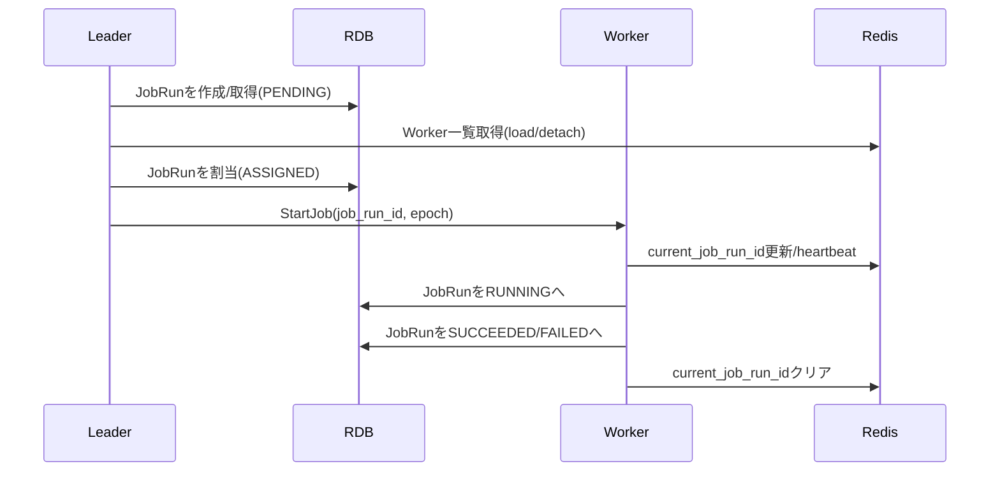
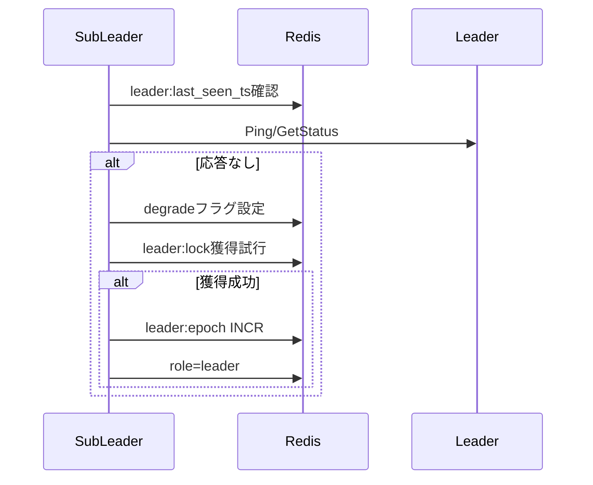

# ジョブ実行制御機能 設計書（Django組み込み）

作成日: 2025-12-28

## 0. 目的 / スコープ

Djangoで開発したアプリケーションに「ジョブ実行制御機能」を組み込み、以下を実現する。

- Management Commandで起動するワーカー群（同一ノード複数・複数ノード分散）
- ワーカー群からLeaderを1つ選出し、スケジューリング/割当を実施（複数ワーカーがいる場合はLeaderは専任）
- SubLeaderを選出し、Leaderの監視・降格・昇格を実現（ネットワーク分断も想定）
- ジョブ定義はRDBに保管（時間起動 + イベント駆動）
- ワーカー状態はRedis（低レイテンシ）に秒単位で報告し、LeaderはgRPCで確認/指示
- 応答がないワーカーは切り離し（detach）し、割当済みジョブは再割当
- 閾値や動作パラメータは管理画面から変更
- 構成・ログ・稼働状況・操作（切り離し/降格など）を画面で確認/操作

## 1. 非機能要件（前提）

### 1.1 想定規模
- 現状: 同時Worker数 3〜5程度
- 将来: 10倍（30〜50）程度までスケールできる設計

### 1.2 HA・ネットワーク分断
- Redisは高可用（Sentinel/Cluster等）を前提
- ネットワーク分断（split brain）を想定し、二重Leader/二重割当の影響を抑制する

### 1.3 ジョブ特性
- リトライ可能なようにジョブ側も設計する
- 実行中ワーカーが切り離された場合:
  - リーダ/サブリーダと再通信できるなら継続を許容してもよい
  - 通信できない場合は強制終了などで整合を回復

## 2. 全体アーキテクチャ

### 2.1 コンポーネント

- Djangoアプリ（組み込み用 reusable app、例: `scheduler`）
  - RDB: ジョブ定義、実行履歴、イベント、設定、操作ログ
  - Management Commands: worker起動、メンテ
  - gRPCサーバ: 各ワーカープロセスがListen（Leader/SubLeaderが呼び出す）
- Redis（高速状態・協調制御）
  - ワーカーのheartbeat/load/role/detach
  - Leader/SubLeader選出ロック
  - フェンシングトークン（epoch）
- gRPC（制御面）
  - Leader/SubLeader → Worker への生存確認/ジョブ開始/停止
- RDB（永続の真実）
  - ジョブ定義・実行履歴・イベント・監査

### 2.2 単一ノード想定（1ノードで全て動く）

- Workerは同一マシンで複数起動可能
- Leader/SubLeaderは「同一ノード」でも選出される（結果、LeaderとSubLeaderが同一ノードになるケースを許容）
- gRPCは localhost/同一VPC 内で通信

### 2.3 分散ノード想定

- node_id（ホスト名/コンテナID等）を各Workerが持つ
- SubLeaderは「Leaderと異なるnode_id優先」で選出
- ただし単一ノード構成では異なるnode_idが存在しないため、同一node_id内でSubLeaderを選出する

## 3. 重要な設計方針（split brain対策）

ネットワーク分断時に二重Leaderや二重実行が起き得るため、以下を組み合わせて影響を最小化する。

- **Redisの分散ロック + TTL**: Leader/SubLeader選出は `SET NX PX`（更新できない場合は役割喪失）
- **フェンシングトークン（epoch）**: Leaderがロック獲得時に `INCR scheduler:leader:epoch` を取得し、すべての指示にepochを付与
  - Workerは受信したepochが最新でない場合、指示を拒否する
  - JobRunの状態遷移（開始/終了の報告）はepochもDBに保存し、古いepochからの更新を拒否できるようにする
- **RDB側の原子性**: JobRunの遷移は「状態 + バージョン（楽観ロック）」または `SELECT FOR UPDATE` により競合を排除
- **冪等性キー**: イベント駆動は `dedupe_key`/`idempotency_key` で重複投入を抑制

### 3.1 役割喪失の定義（Leader/Worker）

ネットワーク分断時に「古いLeaderが動き続ける」ことを前提に、役割喪失を明確化する。

- Leaderは、次のいずれかを満たしたら**即座にLeader役割を停止**し、Workerロールに戻る
  - `scheduler:leader:lock` の更新に失敗（TTL延長不可）
  - 自分がlock保持者でない（lockのvalueが自分のworker_idと異なる）
  - `scheduler:worker:{self}` に `degrade_leader=1` が立った（SubLeaderからの降格）
- Workerは、次のいずれかを満たしたら**新規ジョブ受付を停止（drain相当）**する
  - 自分の `detach` フラグが立った
  - `StartJob` に含まれる `leader_epoch` が自分の観測している最新epochより古い

### 3.2 フェンシングトークン（epoch）の具体運用

- Leaderが `scheduler:leader:lock` を獲得した直後に `epoch = INCR scheduler:leader:epoch` を実行する
- Leaderは以後、外部（WorkerやRDB）へ影響を与える操作に必ず `epoch` を付与する
  - gRPC `StartJob/CancelJob/Drain` のリクエスト
  - RDB `JobRun` の `leader_epoch` 更新
- Workerは次を満たす場合のみ `StartJob` を受け付ける
  - `leader_epoch` が「Redisで観測できる最新epoch（または自分が最後に受理したepoch）」以上

注: RedisがHA構成で分断が起きると「最新epoch」が分断側でズレる可能性があるため、最終防衛線として **RDB側の状態遷移条件**も併用する（3.3）。

### 3.3 JobRun状態遷移の原子性（RDB側のルール）

二重Leaderや重複指示が発生しても、最終的に「同一JobRunの同時RUNNING」を抑止する。

推奨: 楽観ロック（`version`整数）をJobRunに追加し、更新は常に以下の形にする。

- 例: `ASSIGNED -> RUNNING`
  - 更新条件: `state='ASSIGNED'` かつ `assigned_worker_id=<self>` かつ `version=<期待値>`
  - 更新内容: `state='RUNNING'`, `started_at=now`, `leader_epoch=<req_epoch>`, `version=version+1`
- 例: `RUNNING -> SUCCEEDED/FAILED/TIMED_OUT`
  - 更新条件: `state='RUNNING'` かつ `assigned_worker_id=<self>` かつ `leader_epoch=<開始時のepoch>`

代替: DBがPostgreSQL等であれば `SELECT ... FOR UPDATE SKIP LOCKED` による割当/遷移も可能。

### 3.4 「二重実行が起きた場合」の収束

設計として「絶対に二重実行しない」はネットワーク分断下では非常に難しいため、次の優先順位で影響を抑える。

1. 同一 `JobRun` の二重RUNNINGをRDB遷移条件で拒否（3.3）
2. Workerは古いepochの指示を拒否（3.2）
3. Job定義側（ユーザ実装）で冪等性を確保（idempotency_keyや外部ロック）


## 4. データ設計（RDB）

### 4.1 JobDefinition（ジョブ定義）

|項目|型例|説明|
|---|---|---|
|id|PK|ジョブID|
|name|str|表示名|
|enabled|bool|有効/無効|
|type|enum|`time` / `event`|
|command_name|str|実行するManagement Command名|
|default_args_json|json|引数のデフォルト|
|schedule|str/json|分単位のスケジュール表現（後述）|
|timeout_seconds|int|タイムアウト|
|max_retries|int|最大リトライ|
|retry_backoff_seconds|int|バックオフ|
|concurrency_policy|enum|`forbid`/`allow`/`replace`|

#### スケジュール表現（分単位）
MVPでは「cron互換」よりも、UIで安全に編集できる表現を優先してもよい。
例:
- `every_n_minutes: 5`
- `daily_at: 02:30`
- `hourly_at_minute: 15`

将来cron表現を追加する場合は `schedule_type` + `schedule_value` の二段構えにする。

### 4.2 JobRun（実行インスタンス）

|項目|型例|説明|
|---|---|---|
|id|PK|実行ID|
|job_definition|FK|対象定義|
|scheduled_for|datetime|予定時刻|
|assigned_at|datetime|割当時刻|
|assigned_worker_id|str|Redis上のworker_id|
|state|enum|状態（後述）|
|attempt|int|試行回数|
|leader_epoch|int|開始指示のepoch|
|started_at/finished_at|datetime|開始/終了|
|exit_code|int|終了コード|
|error_summary|str|要約|
|log_ref|str|ログ参照ID|
|idempotency_key|str|重複排除|

継続許容（切り離し中の確認）:

|項目|型例|説明|
|---|---|---|
|continuation_state|enum|`NONE`/`CONFIRMING`（確認中は再割当しない）|
|continuation_check_started_at|datetime|確認開始時刻|
|continuation_check_deadline_at|datetime|確認期限（過ぎたら継続不可として停止）|

#### JobRun状態
- PENDING: 作成済み/未割当
- ASSIGNED: 割当済み/未開始
- RUNNING
- SUCCEEDED
- FAILED
- CANCELED
- TIMED_OUT
- ORPHANED: ワーカー消失などで孤児化

#### 遅延バックログのスキップ（長時間停止対策）

全Worker停止などでジョブ実行が止まったあと復旧すると、過去スロットのJobRunが大量に残っている可能性がある。
復旧直後にこれらを一気に処理してしまうと負荷スパイク/意図しない実行が起き得るため、以下の安全弁を用意する。

- 設定: `SCHEDULER_SKIP_LATE_RUNS_AFTER_SECONDS`（秒）
- ルール: `scheduled_for < now - SCHEDULER_SKIP_LATE_RUNS_AFTER_SECONDS` のJobRun（未開始）は **SKIPPED** として扱い、実行しない
- 目的: 長時間停止後の「数分間隔ジョブの大量バックログ実行」を防止
- 運用: スキップされた分の再実行は、必要に応じて手動で対応する

### 4.3 Event（イベント駆動）

|項目|型例|説明|
|---|---|---|
|id|PK|イベントID|
|event_type|str|種別|
|payload_json|json|ペイロード|
|dedupe_key|str|重複排除キー|
|created_at|datetime|作成|
|processed_at|datetime|処理済|

### 4.4 SchedulerSettings（閾値/パラメータ）

管理画面で変更するため、DB（RDB）に永続化する。

例:
- leader_tick_seconds（例: 1）
- assign_ahead_seconds（例: 30〜60）
- heartbeat_interval_seconds（例: 1）
- heartbeat_ttl_seconds（例: 5）
- worker_detach_grace_seconds（例: 5〜10）
- leader_stale_seconds（例: 5〜10）
- reassign_after_seconds（例: 60）
- max_jobs_per_worker（例: 1〜N）

継続許容（切り離し中の再接続）:
- continuation_retry_count（デフォルト: 3）
- continuation_retry_interval_seconds（デフォルト: 0.3）

ログ保持:
- log_retention_days_db（デフォルト: 7）

### 4.5 AdminActionLog（監査）

- 誰が、いつ、どのWorker/JobRunに、切り離し/降格/キャンセル等を行ったか

## 5. Redisキー設計

### 5.1 Worker登録

- `scheduler:worker:id_seq`（INCR）
- `scheduler:worker:{worker_id}`（HASH, TTLあり）
  - node_id
  - pid
  - grpc_host/grpc_port
  - role（leader/subleader/worker）
  - last_heartbeat_ts
  - load（実行中件数）
  - current_job_run_id
  - detached（0/1）

### 5.2 Leader/SubLeader

- `scheduler:leader:lock`（SET NX PX）
- `scheduler:leader:epoch`（INCRでフェンシングトークン）
- `scheduler:leader:last_seen_ts`
- `scheduler:subleader:{node_id}:lock`

### 5.3 切り離し・降格

- `scheduler:detach:{worker_id}`（切り離し指示フラグ）
- `scheduler:leader:degrade`（または `scheduler:worker:{leader_worker_id}` のフィールド）

### 5.4 JobRunの二重割当防止

- `scheduler:jobrun:lease:{job_run_id}`（SET NX PX）

## 6. gRPC設計（概要）

### 6.1 サービス

- WorkerService
  - Ping
  - GetStatus
  - StartJob
  - CancelJob
  - Drain（新規割当停止）

### 6.2 重要フィールド

- `leader_epoch`: StartJob/CancelJobに必須
  - Workerは最新epoch以外を拒否（split brain抑制）
- `job_run_id`: WorkerはRDBのJobRunに紐づけて処理し、状態を更新

### 6.3 認証

最低限の選択肢:
- 推奨: mTLS
- 代替: bearer token（短命、ローテ可能）

## 7. 実行フロー

### 7.1 Worker起動（Management Command）

1. Redisで `worker_id = INCR scheduler:worker:id_seq`
2. `scheduler:worker:{worker_id}` を登録（TTL付き）
3. gRPCサーバ起動（指定port）
4. heartbeatループ開始（1秒）
5. Leaderロック獲得を試行（全Worker共通）

#### Leaderロック獲得（擬似コード）

```text
loop every 1s:
  if detach(self):
    role = worker
    continue

  if try_set_nx_px(leader_lock, value=self.worker_id, ttl=leader_lock_ttl):
    epoch = INCR(leader_epoch)
    role = leader
  else if get(leader_lock) == self.worker_id:
    # 自分が保持者ならTTL延長（renew）
    renew_px(leader_lock, ttl=leader_lock_ttl)
    role = leader
  else:
    role = worker
```

注: renewは「保持者のみ延長できる」原子操作（Lua等）を推奨。

### 7.2 Leaderのスケジューラループ

- `leader_tick_seconds` ごとに実施
  - `scheduler:leader:last_seen_ts` 更新
  - timeジョブの「次回実行」を判定し、必要ならJobRunをPENDINGで作成
  - `assign_ahead_seconds` 以内に入ったJobRunを、負荷の少ないWorkerに割当（ASSIGNEDへ遷移）
  - 実行時刻になったら、割当先Workerへ `StartJob`（epoch付与）

#### 割当アルゴリズム（MVP）

1. Redisから worker一覧を取得（detached=0, heartbeat新鮮、role!=leader を優先）
2. スコアリング（例）
   - `score = load`（小さいほど良い）
   - 同点なら `last_heartbeat_ts` が新しい方
3. `max_jobs_per_worker` を超えるworkerには割り当てない
4. 割当は次の順で実施
   - `SET NX PX scheduler:jobrun:lease:{job_run_id}`（二重割当防止）
   - RDBのJobRunを `ASSIGNED` に更新（状態条件つき）

#### 「Leader専任」ルール

- Workerが複数存在する場合:
  - Leaderは自分自身へジョブを割り当てない（role=leader除外）
- Workerが1つしか存在しない場合（単一プロセス/単一ノード最小構成）:
  - Leaderが自分自身へ割当することを許容する
  - この場合、Leaderは「スケジューラ + 実行」を兼務する

### 7.3 Workerのジョブ実行

- `StartJob` 受信
  - detachフラグが立っていれば拒否
  - epochが最新でなければ拒否
  - `current_job_run_id` をRedisに設定
  - サブプロセスで `python manage.py <command> ...` を起動
  - timeout監視
  - 終了後、RDBのJobRunへ結果反映
  - `current_job_run_id` をクリア

#### 「切り離し中の継続」ルール（要件反映）

ワーカーが実行中に切り離し指示を受けた場合、次の分岐を許容する。

- まず、WorkerはLeader/SubLeaderへgRPCで再確認（短時間）
  - 例: `ConfirmContinuation(job_run_id, leader_epoch)` を問い合わせ（APIは別紙）
- OKが返れば継続してよい
- いずれにも通信できない場合は、強制終了して状態をクリアし、新IDで再参加する

継続許容中の再割当抑止（提案反映）:

- Workerは切り離し指示を検知したら、まずDBのJobRunに以下を記録する
  - `continuation_state=CONFIRMING`
  - `continuation_check_started_at=now`
  - `continuation_check_deadline_at = now + (continuation_retry_count * continuation_retry_interval_seconds) + α`
- Leaderは `continuation_state=CONFIRMING` のJobRunを「孤児化/再割当」の対象から除外する
  - 目的: 確認中に二重実行や二重割当を起こさない
- 確認が成功して継続する場合、Workerは `continuation_state=NONE` に戻して継続する
- 確認が期限切れ/通信不可の場合、Workerはジョブを停止し、JobRunを失敗系（FAILED/TIMED_OUT等）へ遷移させる
  - その後、Leaderが通常の再実行（attempt増）を行う


### 7.4 イベント駆動

- アプリはEventをRDBへ書き込み
- Leaderが未処理Eventをポーリングし、JobRunを作成→割当→実行

## 8. SubLeader設計（監視・昇格）

### 8.1 選出

- 非Leader Workerが `scheduler:subleader:{node_id}:lock` を `SET NX PX` で獲得
- 「Leaderと異なるnode_id優先」は、以下で実現する:
  - SubLeaderはnode_id単位で選出
  - 監視ロジックでは「Leaderのnode_idと異なるSubLeaderが存在するか」を優先利用
  - 単一ノードでは同一node_idのSubLeaderを利用

#### 単一ノード時の補足

- node_idが1つしかない場合でもSubLeaderは選出する
- LeaderとSubLeaderが同一ノードになるが、プロセス障害の検知（Leaderプロセス死亡）には効果がある
- ただし「ノード障害」には効かないため、単一ノード構成でのHAは担保しない（要件上、単一ノードはあくまで想定/開発運用向け）

### 8.2 監視

- `subleader_check_seconds` ごとに
  - `scheduler:leader:last_seen_ts` が古い（> leader_stale_seconds）なら異常候補
  - gRPCでLeader（or leader worker）へPing/GetStatus
  - 応答なしの場合: 降格フラグ（degrade）をRedisへ
  - 自分がLeaderロック獲得を試行し、獲得できれば昇格

## 9. 切り離し・再割当

### 9.1 切り離し判定

- LeaderがWorkerに対して gRPCが連続失敗、かつ heartbeatがTTL切れ/古い
- `scheduler:detach:{worker_id}=1` をセット
- 当該Workerへの新規割当を停止

#### 判定の目安（設定で変更可能）

- `heartbeat_interval_seconds=1`, `heartbeat_ttl_seconds=5`
- `worker_detach_grace_seconds=5`（= 最低5秒の猶予）
- gRPCは `Ping` を短いdeadline（例: 200ms〜500ms）で複数回

分断時には誤検知が増えるため、切り離しは「割当停止 + 再割当」で収束させ、過度に強制終了しない。

### 9.2 再割当

- ASSIGNEDのまま一定時間進まないJobRun（> reassign_after_seconds）をORPHANEDへ
- 別Workerへ再割当（attemptを増やす）

### 9.3 「切り離されたが実は正常」ケース

- Workerは秒単位で `scheduler:detach:{my_id}` を確認
- 立っていたら
  - 実行中ジョブを停止（subprocess kill）
  - 状態をクリア
  - 新しいworker_idで再参加

## 10. ログ/可観測性

- RDBには「要約 + 参照」を保存（全文は外部集約が望ましい）
- log_ref例: ファイルパス、ELKのtrace id、クラウドログのURL
- 画面からは JobRun → log_ref へ遷移できるようにする

### 10.1 ログ保持方針（確定案）

- 直近一定期間（デフォルト: 1週間）のログはRDBに保持する（期間は設定で変更可能）
- 上記期間を過ぎたログは、ファイルへ退避する（例: S3互換オブジェクトストレージ）
- RDBには `log_ref`（オブジェクトキー/URL等）を保持し、運用画面から参照できるようにする

## 11. セキュリティ

- gRPC認証（mTLS採用）
- Django側の管理画面はDjango認証/権限で保護
- 操作（切り離し/降格/キャンセル）は監査ログへ

### 11.1 証明書更新（MVP運用前提）

- K8s（Meshなし）をMVP前提とし、証明書は `cert-manager` でSecretを更新する
- アプリがホットリロードを持たないMVPでは、更新反映はDeploymentのローリング更新で行う
- 開発環境では長期（実質無期限）証明書運用を許容する

デフォルト規約:
- TLSファイルパス: `/etc/scheduler/tls/tls.crt` と `/etc/scheduler/tls/tls.key`
- K8s Secret名: 全Podで同一（例: `scheduler-grpc-tls`）

拡張:
- Podごとに証明書を分ける場合は、Helm/Kustomize等のデプロイ設定でSecret名を差し替える（K8sの制約上、実行時動的切替は不可）

## 12. Mermaid図（概念）

### 12.1 割当〜実行



### 12.2 SubLeader昇格



## 13. 未決事項（次工程で確定）

次工程で仕様として固定する項目（合意案）:

- スケジュール表現: UIで安全に編集できる形式を採用する
- gRPC認証方式: mTLSを採用する
- Workerの「継続許容」ルール:
  - 指定のリトライ回数内でLeaderまたはSubLeaderと通信が可能になった場合は継続を許容する
  - デフォルト: 3回、0.3秒間隔（いずれも設定で変更可能）
- ログの格納先:
  - 直近1週間分はDBに保持（期間は設定で変更可能）
  - それ以降はファイル（S3互換オブジェクトストレージ等）へ退避し、DBには参照（log_ref）を保持する

---

次のドキュメントとして、独自管理画面（Django Adminを使わない）設計を `docs/operations-ui.md` にまとめる。
